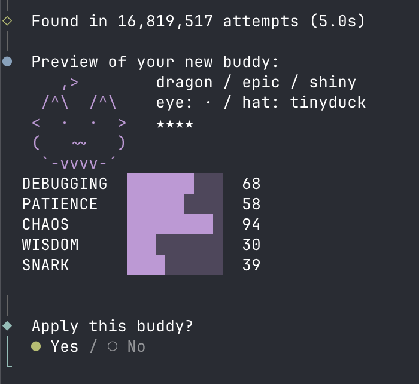

# buddy-fixer

A CLI tool to view, customize, or delete your [Claude Code](https://docs.anthropic.com/en/docs/claude-code) companion buddy.

Claude Code assigns you a randomly generated buddy companion (species, rarity, eyes, hat, stats) based on a salt baked into the binary. This tool brute-forces a new salt that produces the exact buddy you want, then patches it into the binary.

## Features

- **View** your current buddy with sprite, stats, and rarity
- **Customize** species, rarity, eye style, hat, shiny status, and stat distribution
- **Delete** buddy data from your config (with automatic backup)
- Automatic binary backup and macOS code re-signing

## Requirements

- [Bun](https://bun.sh) runtime (uses `Bun.hash` for deterministic hashing)
- Claude Code installed

## Screenshot



## Install

```bash
git clone https://github.com/mick340/claude-buddy-fixer.git
cd claude-buddy-fixer
bun install
```

## Usage

```bash
bun start
```

You'll get an interactive menu:

1. **View current buddy** — see your buddy's sprite, rarity, and stats
2. **Customize buddy** — pick your desired species, rarity, eyes, hat, shiny, and stats (highest/lowest), then brute-force a matching salt
3. **Delete buddy** — remove buddy data from config (backs up first)

### Stat customization

Each buddy has five stats: **Debugging**, **Patience**, **Chaos**, **Wisdom**, and **Snark**. When customizing, you can choose which stat should be the highest (peak) and which should be the lowest (dump). The brute-forcer will only accept salts that produce a buddy matching all your criteria, including the stat distribution.

## How it works

1. Reads the Claude Code binary to find the current companion salt
2. Uses the same PRNG algorithm as Claude Code to roll buddy attributes from a salt + user ID
3. Brute-forces salts until one produces a buddy matching your target criteria
4. Patches the salt in the binary (same length, so no offset changes)
5. Re-signs the binary on macOS (`codesign -s -`)
6. Clears cached companion data from your Claude config so the new buddy is picked up on next launch

## Safety

- The original binary is backed up before patching (`<binary>.backup`)
- Your Claude config is backed up before any changes (`<config>.backup.json`)
- You can always restore from the backups if something goes wrong

## Disclaimer

This tool modifies the Claude Code binary. Use at your own risk. It is not affiliated with or endorsed by Anthropic.

## License

MIT
